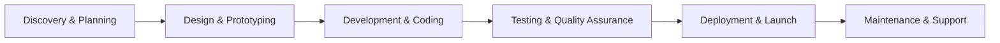

# 👋 Welcome to BookMyCode-Freelance Development Partner!

<div align="center">
  
</div>

<h1 align="center">
  
</h1>

<div align="center">
  
  <a href="https://github.com/BookMyCode?tab=repositories">
    
  </a>
  <a href="https://bookmycode.github.io/freelance_Portfolio/">
    
  </a>
</div>

<div align="center">
  
</div>

## 🏢 About BookMyCode

```javascript
const bookMyCode = {
    companyType: "Professional Freelance Development Organization",
    specialization: ["Web Development", "Salesforce Solutions", "Mobile Apps", "Custom Software"],
    established: "2023",
    mission: "Deliver high-quality, scalable solutions that drive business growth",
    vision: "To be the most trusted freelance development partner for businesses worldwide",
    values: ["Quality", "Reliability", "Innovation", "Client Satisfaction"]
};
```

<div align="center">
  
</div>

## 💼 Our Services

<div align="center">

| 🎨 **Web Development** | ☁️ **Salesforce Solutions** | 📱 **Mobile Development** | 🔧 **Custom Solutions** |
|:----------------------:|:---------------------------:|:-------------------------:|:-----------------------:|
| • React/Next.js Applications<br>• Node.js Backend<br>• E-commerce Solutions<br>• API Development | • Custom Apex Development<br>• Lightning Web Components<br>• Salesforce Integration<br>• AppExchange Packages | • React Native Apps<br>• iOS & Android<br>• Cross-Platform<br>• PWA Development | • Database Design<br>• System Architecture<br>• DevOps & Deployment<br>• Technical Consulting |

</div>

## 🛠️ Our Tech Stack

<div align="center">

### 🌐 Frontend Technologies
<p>
  
  
  
  
  
  
  
</p>

### ⚙️ Backend Technologies
<p>
  
  
  
  
  
</p>

### ☁️ Salesforce & Cloud
<p>
  
  
  
  
  
</p>

### 🗄️ Databases
<p>
  
  
  
  
</p>

### 📱 Mobile & Tools
<p>
  
  
  
  
</p>

</div>

<div align="center">
  
</div>

## 📊 Our GitHub Stats

<div align="center">
  
  
</div>

<div align="center">
  
</div>

## 🌟 Featured Projects

<div align="center">

| Project | Description | Tech Stack | Live Demo |
|---------|-------------|------------|-----------|
| 🎯 **Portfolio Website** | Professional freelance portfolio showcasing our work | React, Tailwind CSS, JavaScript | [View Live](https://bookmycode.github.io/freelance_Portfolio/) |
| ☁️ **Salesforce CRM** | Custom CRM solution for small businesses | Apex, Lightning, SOQL | Enterprise Solution |
| 📱 **Task Manager App** | Cross-platform task management application | React Native, Firebase | Available on Stores |
| 🌐 **E-commerce Platform** | Full-stack e-commerce solution | MERN Stack, Stripe API | Client Project |

</div>

## 🏆 Why Choose BookMyCode?

<div align="center">

| ✅ **Quality Assurance** | ⏱️ **Timely Delivery** | 💬 **Clear Communication** | 🔄 **Agile Development** |
|:------------------------:|:-----------------------:|:--------------------------:|:------------------------:|
| Code reviews & testing | On-time project completion | Regular updates & feedback | Flexible & adaptive approach |
| **💰 Competitive Pricing** | **🔒 Data Security** | **📞 24/7 Support** | **🚀 Scalable Solutions** |
| Transparent pricing models | Secure development practices | Ongoing maintenance & support | Future-proof architecture |

</div>

<div align="center">
  
</div>

## 🤝 Let's Work Together!

<div align="center">

### 📞 Get In Touch
[](https://bookmycode.github.io/freelance_Portfolio/)
[](mailto:bookmycode.dev@gmail.com)
[](https://linkedin.com/company/bookmycode)
[](https://wa.me/your-number)

### 💼 Business Hours
**Monday - Friday**: 9:00 AM - 6:00 PM (IST)  
**Weekend Support**: Available for urgent projects  
**Response Time**: Within 2 hours during business hours

</div>

## 📈 Our Process



<div align="center">
  <h3>💡 Ready to Start Your Project?</h3>
  
  [](https://bookmycode.github.io/freelance_Portfolio/#contact)
  [](https://bookmycode.github.io/freelance_Portfolio/)
</div>

<div align="center">
  
</div>

## 📢 Testimonials

> "BookMyCode delivered exceptional quality work on time and within budget. Their attention to detail and communication throughout the project was outstanding!" - **Happy Client**

> "Professional team with excellent technical skills. They understood our requirements perfectly and provided a solution that exceeded our expectations." - **Satisfied Customer**

---

<div align="center">
  <h3>⭐ From <a href="https://github.com/BookMyCode">BookMyCode</a> with ❤️</h3>
  <p><b>Your Vision, Our Code - Perfectly Executed! 🚀</b></p>
  
  [](https://bookmycode.github.io/freelance_Portfolio/)
</div>

<div align="center">
  
</div>
